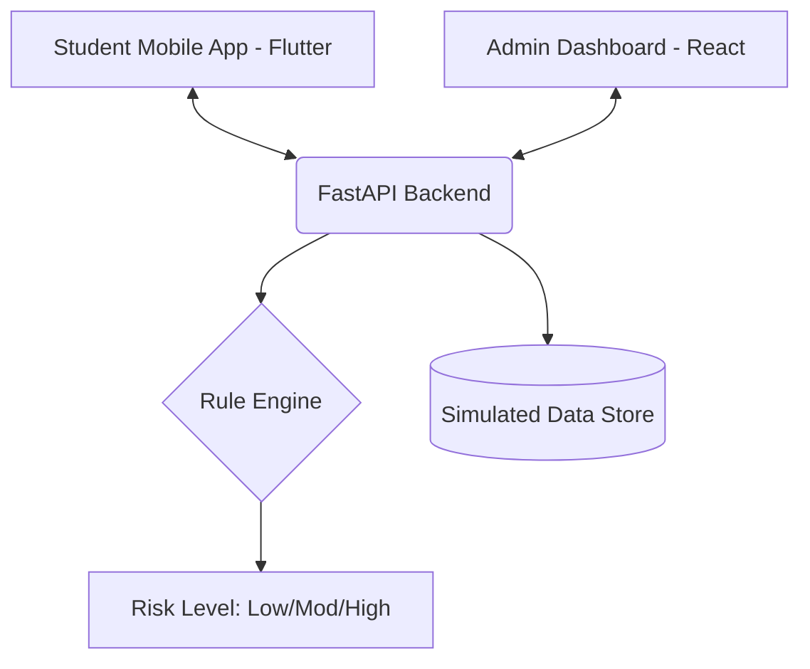

# COGNIS: Academic Stress Early Warning System

> **Detecting burnout before it happens.** A rule-based early warning system that monitors behavioral academic signals to flag student stress risk early.

---

## 🌟 Overview

Educational institutions typically detect student stress only after academic performance declines. **COGNIS** proposes a proactive solution that analyzes real-time academic behavior—like attendance drops and submission delays—to calculate an explainable **Stress Risk Score (0-100)**.

This project was built for a 24-hour hackathon, focusing on interpretability, speed, and cross-platform accessibility.

---

## 🏗️ Project Architecture

The system consists of three main components working in harmony:

1.  **Backend (FastAPI)**: The brain of the system. It houses the Rule Engine, manages the data store, and exposes REST endpoints.
2.  **Admin Dashboard (React)**: A professional interface for faculty and administrators to monitor student health, view "At-Risk" lists, and perform "What-if" simulations.
3.  **Mobile App (Flutter)**: A personalized student portal where individuals can track their stress levels, view workload graphs, and receive tailored recommendations.



---

## 🛠️ Tech Stack

-   **Backend**: Python, FastAPI, Uvicorn, Pydantic
-   **Frontend Dashboard**: React, Chart.js, Vanilla CSS (Modern UI)
-   **Mobile App**: Flutter, Dart, Provider
-   **Design Philosophy**: Premium glassmorphism, high-contrast dark modes, and micro-animations.

---

## 🚀 Getting Started

### 1. Prerequisites
- Python 3.9+
- Node.js & npm
- Flutter SDK

### 2. Backend Setup
```bash
# Navigate to root
python -m venv venv
source venv/bin/activate  # On Windows: venv\Scripts\activate
pip install fastapi uvicorn pydantic
python app/main.py
```
*API docs available at: `http://localhost:8000/docs`*

### 3. Admin Dashboard Setup
```bash
cd admin-dashboard
npm install
npm run dev
```

### 4. Mobile App (Flutter) Setup
```bash
cd stress_monitor
flutter pub get
flutter run
```

---

## ✨ Features

-   **Explainable Risk Scoring**: Rules tell you *why* a student is stressed (e.g., "Attendance drop > 20%").
-   **What-if Simulator**: Faculty can simulate how fixing attendance or workload would reduce a student's risk.
-   **Live Data Ingestion**: Endpoints for real-time simulation of assignment submissions and attendance logs.
-   **Personalized Recommendations**: Students get actionable advice based on their specific risk triggers.
-   **Stress Trend Visualization**: 8-week history tracking using interactive line charts.

---

## 👥 Contributors

This project was built with ❤️ by:

| Name | GitHub | LinkedIn |
| :--- | :--- | :--- |
| **Rohith Kanna S** | [Rohithkannas](https://github.com/Rohithkannas) | [LinkedIn](https://www.linkedin.com/in/rohith4510/) |
| **Sudhan S** | [sudhans18](https://github.com/sudhans18) | [LinkedIn](https://www.linkedin.com/in/sudhan18/) |

---

## 📜 License

This project is licensed under the MIT License - see the LICENSE file for details.
